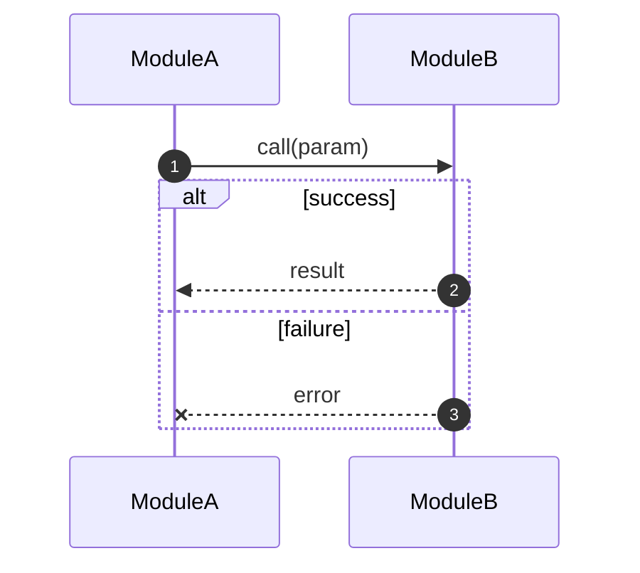

# Flow-Tracer — Data Flow, Logs, And Impact Analysis

Analyze existing code by reading function headers/docstrings and log statements. Function headers are the source of truth; legacy file-level `@business/@architecture` blocks are only fallback context.

## Chain Position

```
dev-flow (code generation complete)
  └─ flow-tracer (YOU) — post-hoc analysis on demand
```

## Input Sources

Scan code for:

- Function headers/docstrings containing `ROLE`, `DEPENDS_ON`, `IN`, `OUT`, `OWNS_FIELDS`, `SIDE`, `ERRORS`, `LOG`.
- Actual log statements and their file:line locations.
- Legacy top-level `@business/@architecture` only when function headers are missing or incomplete.

## Output Structure

Always output in this order.

### Section 0: Module Overview

A markdown table summarizing each module's role, key entry points, core fields, and side effects.

### Sections 1-N: Per-Phase Breakdown

For each logical phase, output:

#### a) Sequence Diagram

Use Mermaid `sequenceDiagram` to show execution order and data flow.



#### b) Log Trace Table

| 函数 | INFO（生产） | DEBUG（调试） | WARNING/ERROR | 文件:行 |
|---|---|---|---|---|
| `func_name` | `grep "业务动作.*| IN |"` | `grep "业务动作.*| MAP |"` | `grep "业务动作.*| ERR |"` | `file.py:123` |

#### c) Field Ownership Table

| 字段 | 归属函数 | 来源 | 输出/影响 |
|---|---|---|---|
| `field_name` | `owning_function` | `IN` / derived | `OUT` / side effect |

### End-To-End Overview

A single `sequenceDiagram` showing all phases with `rect` blocks for grouping.

### Complete Log Trace Summary

| # | 阶段 | 函数 | INFO grep | DEBUG grep | ERR grep | 文件:行 |
|---|---|---|---|---|---|---|

### Impact Analysis

When the user asks about a specific change, trace by `OWNS_FIELDS`, `OUT`, and `DEPENDS_ON`:

```
IMPACT ANALYSIS
══════════════════

OWNER:
  <function>
  └─ OWNS_FIELDS / ROLE / OUT 中的具体影响点

DOWNSTREAM:
  ├─ <function>: DEPENDS_ON=[owner]
  │  └─ 验证: <check>
  └─ <function>
     └─ 验证: <check>

AFFECTED HEADERS:
  <function>: ROLE/IN/OUT/OWNS_FIELDS/SIDE/ERRORS/LOG 需要同步项

AFFECTED LOGS:
  grep "<关键词> | INFO |" <file>
  grep "<关键词> | DEBUG |" <file>
  grep "<关键词> | ERR |" <file>
```

## Workflow

1. Parse function headers/docstrings first.
2. Build the `DEPENDS_ON` DAG.
3. Build field ownership from `OWNS_FIELDS`.
4. Cross-check logs against each function's `LOG` section.
5. Group functions into logical phases.
6. Generate diagrams, log tables, field tables, and impact analysis.
7. Flag missing or stale headers when implementation, logs, or dependencies contradict the header.

## Key Principles

- Function headers are the durable architecture record.
- Prefer `sequenceDiagram` for execution order clarity.
- Every log entry should include file:line.
- Impact analysis must include headers, implementation, downstream functions, and logs.
- If legacy `@architecture` conflicts with function headers, trust function headers and report the conflict.